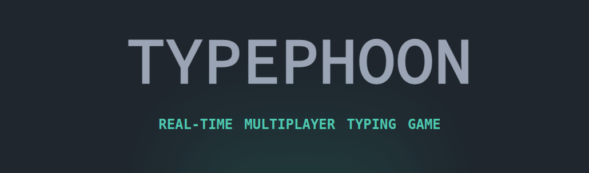
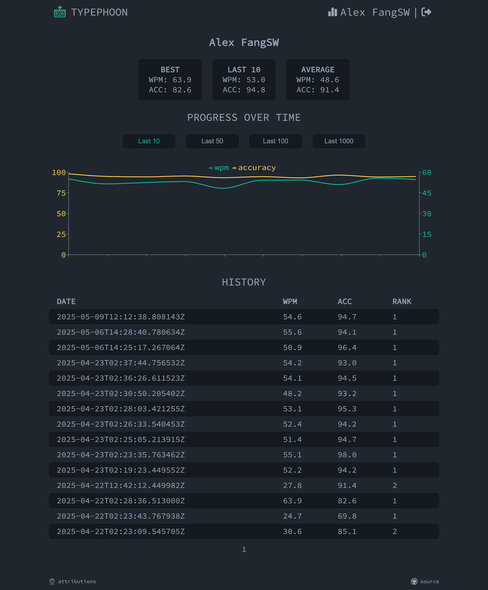

# Typephoon Backend

## About
Typephoon is a real-time multiplayer typing game with a clean, 
minimalistic interface inspired by [monkeytype](https://monkeytype.com/). 
Challenge your friends or other players online, track your typing progress over time.

## Features
- Multi-player gameplay
- Minimalistic design inspired by monkeytype
- Player history / progress tracking
- Login with google (oauth2)

## Previews
### Multi-player gameplay
<video src="https://youtu.be/l1kkJKtrBEw" width="352" height="720"></video>

### Player history / progress tracking

## Build
For implementation details, refer to [build.md](./doc/build.md)
